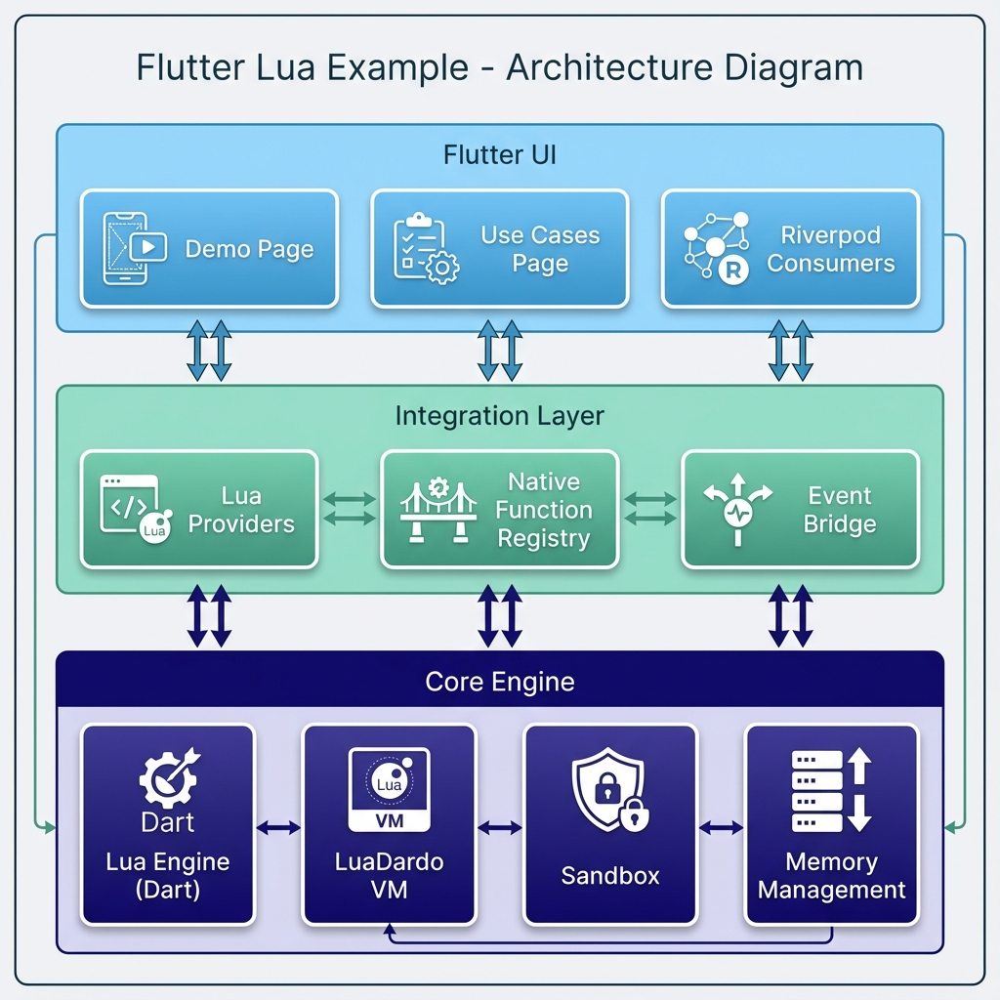
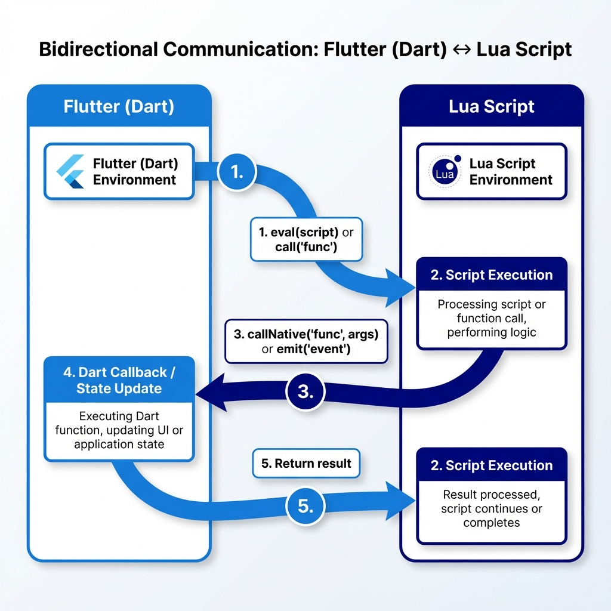

# Flutter Lua Example


[English](README.md) | [繁體中文](README_zh.md)

---


A Flutter application demonstrating Lua scripting integration using a pure Dart Lua VM implementation (LuaDardo).

### Features

- **Pure Dart Lua VM**: Cross-platform support (Android, iOS, Web) using [LuaDardo Plus](https://github.com/ImL1s/LuaDardo/tree/develop) (a maintained fork of LuaDardo)
- **Sandbox Mode**: Secure execution environment with dangerous Lua libraries removed (`os`, `io`, `debug`, `dofile`, `loadfile`)
- **Bidirectional Interaction**: Flutter can call Lua functions, Lua can invoke native Dart callbacks
- **State Management**: Riverpod 3.x integration for reactive state synchronization between Lua and Flutter
- **Event System**: Custom event emission from Lua to Flutter (logs, toasts, navigation)
- **Real-World Use Cases**: Practical examples including form validation, pricing engine, A/B testing, and more

### Architecture



```
lib/
├── core/
│   ├── lua_engine/
│   │   ├── lua_engine.dart          # Abstract LuaEngine interface
│   │   ├── lua_engine_dart.dart     # LuaDardo implementation
│   │   ├── lua_event.dart           # Event types (log, toast, navigate, etc.)
│   │   ├── lua_exception.dart       # Custom exceptions
│   │   └── lua_value.dart           # Value type wrappers
│   └── providers/
│       └── lua_providers.dart       # Riverpod providers for Lua engine
├── features/
│   ├── demo/
│   │   └── demo_page.dart           # Interactive demo UI
│   └── use_cases/
│       ├── use_case_scripts.dart    # Real-world Lua script examples
│       └── use_cases_page.dart      # Use cases demo page
└── main.dart
```

### Quick Start

#### Prerequisites

- Flutter SDK 3.9.2+
- Dart SDK 3.9.2+

#### Installation

```bash
git clone https://github.com/ImL1s/flutter_lua_example.git
cd flutter_lua_example
flutter pub get
```

#### Run

```bash
# Run on connected device
flutter run

# Run tests
flutter test

# Run integration tests (requires device/emulator)
flutter test integration_test/
```

### Usage

#### Basic Lua Execution

```dart
final container = ProviderContainer();
final notifier = container.read(luaEngineProvider.notifier);

// Initialize engine
await notifier.initialize();

// Execute Lua code
final result = await notifier.eval('return 1 + 2');
print(result); // 3

// Call Lua function
await notifier.eval('function double(x) return x * 2 end');
final doubled = await notifier.call('double', [21]);
print(doubled); // 42
```

#### Bidirectional Communication




```dart
// Register Dart function callable from Lua
notifier.registerFunction('multiply', (args) {
  return (args[0] as num) * (args[1] as num);
});

// Call from Lua
await notifier.eval("return callNative('multiply', 6, 7)"); // 42
```

#### State Synchronization

```dart
// From Lua: set state
await notifier.eval("callNative('setState', 'counter', 42)");

// From Dart: read state
final counter = container.read(luaStateProvider('counter'));
print(counter); // 42
```

#### Event Emission

```lua
-- From Lua: emit toast event
emit('toast', {message = 'Hello from Lua!', type = 'success'})

-- From Lua: log message
print('This will appear in the log')
```

### Built-in Native Functions

| Function | Description | Example |
|----------|-------------|---------|
| `callNative('setState', key, value)` | Set state variable | `callNative('setState', 'count', 1)` |
| `callNative('getState', key)` | Get state variable | `callNative('getState', 'count')` |
| `callNative('showToast', message)` | Show toast notification | `callNative('showToast', 'Hello!')` |
| `callNative('navigateTo', route)` | Navigate to route | `callNative('navigateTo', '/settings')` |
| `callNative('log', level, message)` | Log message | `callNative('log', 'info', 'debug')` |
| `callNative('delay', ms)` | Async delay | `callNative('delay', 1000)` |
| `emit(event, data)` | Emit custom event | `emit('toast', {message='Hi'})` |
| `print(...)` | Log output | `print('Hello', 'World')` |

### Testing

The project includes comprehensive tests:

- **Unit Tests**: `test/lua_engine_test.dart` - LuaEngine core functionality (50+ tests)
- **Provider Tests**: `test/lua_providers_test.dart` - Riverpod state management
- **Widget Tests**: `test/widget_test.dart` - UI smoke tests
- **Integration Tests**: `integration_test/app_test.dart` - E2E user flows (30+ tests)
  - Basic Demo Page tests (15 tests)
  - Use Cases Page tests (15 tests)

```bash
# Run all tests
flutter test

# Run with coverage
flutter test --coverage

# Run integration tests on simulator
flutter test integration_test/ -d <device_id>

# Run only Use Cases Page E2E tests
flutter test integration_test/ -d <device_id> --plain-name "Use Cases Page"
```

### Dependencies

| Package | Version | Purpose |
|---------|---------|---------|
| [flutter_riverpod](https://pub.dev/packages/flutter_riverpod) | ^3.1.0 | State management |
| [lua_dardo_plus](https://github.com/ImL1s/LuaDardo) | ^0.3.0 | Pure Dart Lua 5.3 VM (maintained fork) |
| [http](https://pub.dev/packages/http) | ^1.2.0 | Script downloading |
| [path_provider](https://pub.dev/packages/path_provider) | ^2.1.0 | File paths |
| [crypto](https://pub.dev/packages/crypto) | ^3.0.3 | Signature verification |

### Real-World Use Cases

The app includes practical examples demonstrating Lua's use in production apps:

| Use Case | Description | Scenario |
|----------|-------------|----------|
| **Form Validation** | Dynamic validation rules engine | E-commerce checkout, user registration |
| **UI Visibility** | Control UI based on user/config | VIP features, A/B testing, localization |
| **Pricing Engine** | Discount and pricing rules | E-commerce promotions, coupons |
| **A/B Testing** | Feature flags & experiments | Gradual rollout, UI experiments |
| **Workflow Engine** | Approval process logic | Leave requests, order approval |
| **Push Strategy** | Smart notification decisions | Cart reminders, re-engagement |

These examples showcase how Lua scripts can be hot-updated to modify app behavior without requiring app store updates.

### Security Considerations

- Lua sandbox mode removes dangerous libraries by default
- No file system or OS access from Lua scripts
- Script signature verification support for hot updates
- Memory limits configurable per engine instance

---

## License

MIT License

## Acknowledgments

- [LuaDardo](https://github.com/arcticfox1919/LuaDardo) - Original Pure Dart Lua implementation
- [LuaDardo Plus](https://github.com/ImL1s/LuaDardo/tree/develop) - Maintained fork with bug fixes
- [Riverpod](https://riverpod.dev/) - Reactive state management
