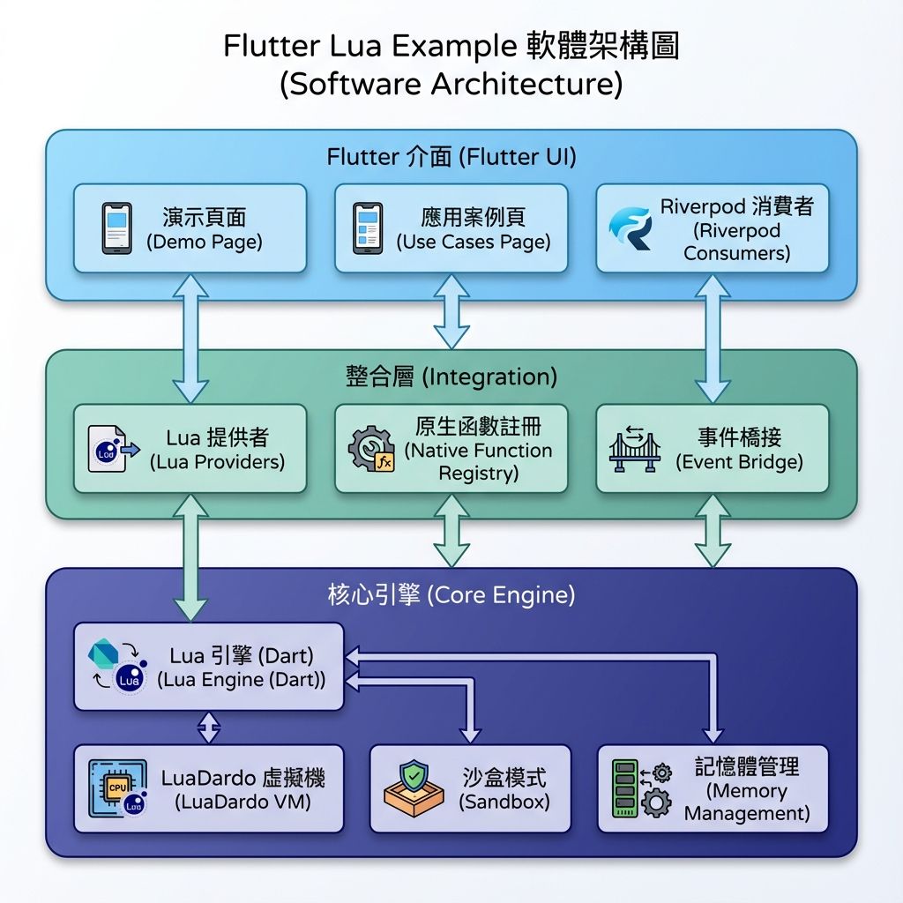
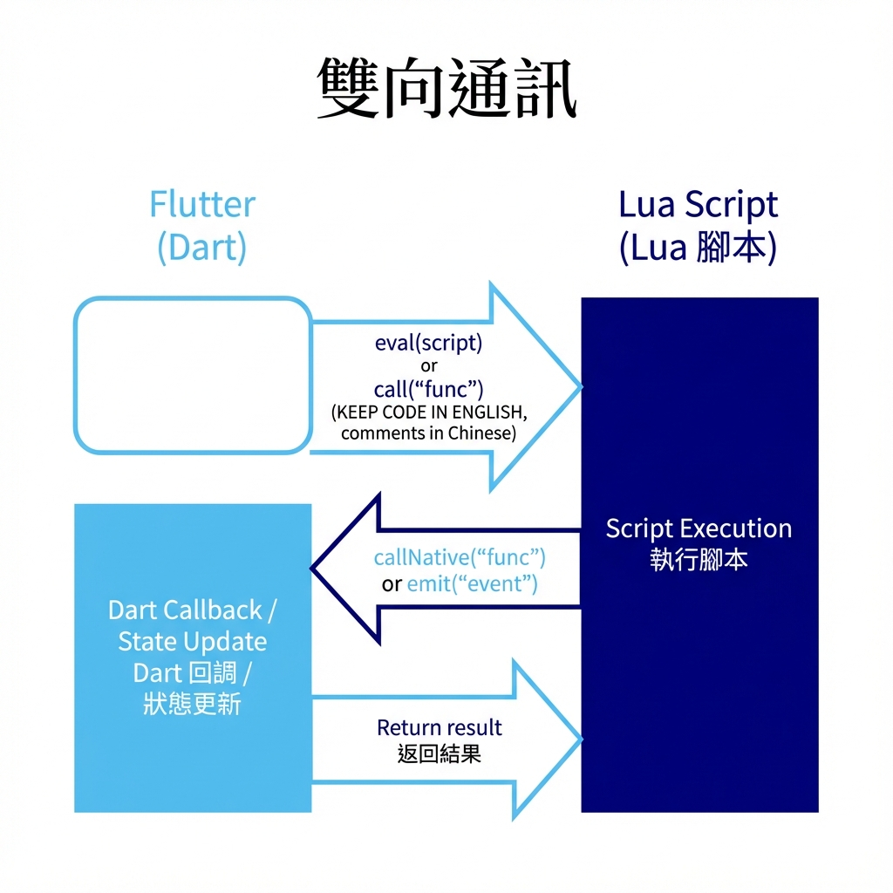

# Flutter Lua Example


[English](README.md) | [繁體中文](README_zh.md)

---

一個展示如何使用純 Dart Lua VM（LuaDardo）在 Flutter 中整合 Lua 腳本的應用程式。

### 功能特色

- **純 Dart Lua VM**：使用 [LuaDardo Plus](https://github.com/ImL1s/LuaDardo/tree/develop) (維護中的分支) 實現跨平台支援（Android、iOS、Web）
- **沙盒模式**：安全的執行環境，已移除危險的 Lua 函式庫（`os`、`io`、`debug`、`dofile`、`loadfile`）
- **雙向交互**：Flutter 可呼叫 Lua 函數，Lua 可調用原生 Dart 回調
- **狀態管理**：整合 Riverpod 3.x，實現 Lua 與 Flutter 之間的響應式狀態同步
- **事件系統**：支援從 Lua 向 Flutter 發送自定義事件（日誌、Toast、導航）
- **實用場景**：包含表單驗證、定價引擎、A/B 測試等實際應用範例

### 架構



```
lib/
├── core/
│   ├── lua_engine/
│   │   ├── lua_engine.dart          # LuaEngine 抽象介面
│   │   ├── lua_engine_dart.dart     # LuaDardo 實現
│   │   ├── lua_event.dart           # 事件類型（log、toast、navigate 等）
│   │   ├── lua_exception.dart       # 自定義異常
│   │   └── lua_value.dart           # 值類型包裝器
│   └── providers/
│       └── lua_providers.dart       # Lua 引擎的 Riverpod providers
├── features/
│   ├── demo/
│   │   └── demo_page.dart           # 互動式 Demo UI
│   └── use_cases/
│       ├── use_case_scripts.dart    # 實用場景 Lua 腳本範例
│       └── use_cases_page.dart      # 實用場景展示頁面
└── main.dart
```

### 快速開始

#### 環境需求

- Flutter SDK 3.9.2+
- Dart SDK 3.9.2+

#### 安裝

```bash
git clone https://github.com/ImL1s/flutter_lua_example.git
cd flutter_lua_example
flutter pub get
```

#### 執行

```bash
# 在連接的裝置上執行
flutter run

# 執行測試
flutter test

# 執行整合測試（需要裝置/模擬器）
flutter test integration_test/
```

### 使用方式

#### 基本 Lua 執行

```dart
final container = ProviderContainer();
final notifier = container.read(luaEngineProvider.notifier);

// 初始化引擎
await notifier.initialize();

// 執行 Lua 程式碼
final result = await notifier.eval('return 1 + 2');
print(result); // 3

// 呼叫 Lua 函數
await notifier.eval('function double(x) return x * 2 end');
final doubled = await notifier.call('double', [21]);
print(doubled); // 42
```

#### 雙向通訊



```dart
// 註冊可從 Lua 呼叫的 Dart 函數
notifier.registerFunction('multiply', (args) {
  return (args[0] as num) * (args[1] as num);
});

// 從 Lua 呼叫
await notifier.eval("return callNative('multiply', 6, 7)"); // 42
```

#### 狀態同步

```dart
// 從 Lua：設定狀態
await notifier.eval("callNative('setState', 'counter', 42)");

// 從 Dart：讀取狀態
final counter = container.read(luaStateProvider('counter'));
print(counter); // 42
```

#### 事件發送

```lua
-- 從 Lua：發送 toast 事件
emit('toast', {message = 'Hello from Lua!', type = 'success'})

-- 從 Lua：記錄日誌
print('This will appear in the log')
```

### 內建原生函數

| 函數 | 說明 | 範例 |
|------|------|------|
| `callNative('setState', key, value)` | 設定狀態變數 | `callNative('setState', 'count', 1)` |
| `callNative('getState', key)` | 取得狀態變數 | `callNative('getState', 'count')` |
| `callNative('showToast', message)` | 顯示 Toast 通知 | `callNative('showToast', 'Hello!')` |
| `callNative('navigateTo', route)` | 導航至路由 | `callNative('navigateTo', '/settings')` |
| `callNative('log', level, message)` | 記錄日誌 | `callNative('log', 'info', 'debug')` |
| `callNative('delay', ms)` | 異步延遲 | `callNative('delay', 1000)` |
| `emit(event, data)` | 發送自定義事件 | `emit('toast', {message='Hi'})` |
| `print(...)` | 日誌輸出 | `print('Hello', 'World')` |

### 測試

專案包含完整的測試：

- **單元測試**：`test/lua_engine_test.dart` - LuaEngine 核心功能（50+ 測試）
- **Provider 測試**：`test/lua_providers_test.dart` - Riverpod 狀態管理
- **Widget 測試**：`test/widget_test.dart` - UI 冒煙測試
- **整合測試**：`integration_test/app_test.dart` - E2E 使用者流程（30+ 測試）
  - 基礎 Demo 頁面測試（15 個）
  - 實用場景頁面測試（15 個）

```bash
# 執行所有測試
flutter test

# 執行覆蓋率測試
flutter test --coverage

# 在模擬器上執行整合測試
flutter test integration_test/ -d <device_id>

# 只執行實用場景頁面的 E2E 測試
flutter test integration_test/ -d <device_id> --plain-name "Use Cases Page"
```

### 依賴套件

| 套件 | 版本 | 用途 |
|------|------|------|
| [flutter_riverpod](https://pub.dev/packages/flutter_riverpod) | ^3.1.0 | 狀態管理 |
| [lua_dardo](https://pub.dev/packages/lua_dardo) | ^0.0.5 | 純 Dart Lua 5.3 VM |
| [http](https://pub.dev/packages/http) | ^1.2.0 | 腳本下載 |
| [path_provider](https://pub.dev/packages/path_provider) | ^2.1.0 | 檔案路徑 |
| [crypto](https://pub.dev/packages/crypto) | ^3.0.3 | 簽名驗證 |

### 實用場景

應用程式包含展示 Lua 在生產環境中使用的實際範例：

| 場景 | 說明 | 應用情境 |
|------|------|----------|
| **表單驗證** | 動態驗證規則引擎 | 電商結帳、用戶註冊 |
| **UI 可見性** | 根據用戶/配置控制 UI | VIP 功能、A/B 測試、本地化 |
| **定價引擎** | 折扣與定價規則 | 電商促銷、優惠券 |
| **A/B 測試** | 功能開關與實驗 | 灰度發布、UI 實驗 |
| **審批流程** | 審批流程邏輯 | 請假申請、訂單審批 |
| **推送策略** | 智能通知決策 | 購物車提醒、用戶召回 |

這些範例展示了如何通過熱更新 Lua 腳本來修改應用程式行為，無需透過應用商店更新。

### 安全考量

- Lua 沙盒模式預設移除危險函式庫
- Lua 腳本無法存取檔案系統或作業系統
- 支援熱更新腳本的簽名驗證
- 可針對每個引擎實例配置記憶體限制

---

## License

MIT License

## Acknowledgments

- [LuaDardo](https://github.com/nicloay/lua_dardo) - Pure Dart Lua implementation
- [Riverpod](https://riverpod.dev/) - Reactive state management
